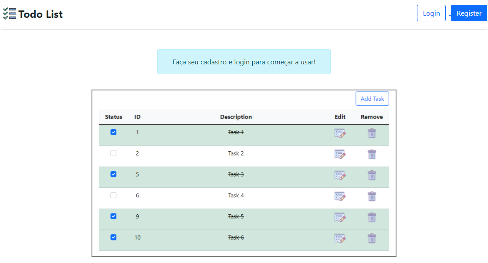

# To-do List

Projeto de desenvolvimento de um To-do List inspirado no challenge https://github.com/AlayaCare/backend-python-test.

## 🚀 Começando
Essas instruções permitirão que você obtenha uma cópia do projeto em operação na sua máquina local para fins de desenvolvimento e teste.

### 📋 Pré-requisitos

De que coisas você precisa para instalar o software e como instalá-lo?
Primeiro, clone este projeto em sua máquina, crie um ambiente virtual e ative. Feito isso, execute o seguinte comando para instalar todas as suas dependências:

```
pip install -r requirements.txt
```

Caso queira fazer melhorias ou alterações no projeto, execute este comando:
```
pre-commit install
```

Após isso, execute este comando para criação e migrações do banco de dados:
```
flask db upgrade
```

Agora você já pode executar este ultimo comando para iniciar a aplicação:
```
python app.py runserver
```

## 🖨️ Página inicial do projeto



## 🛠️ Estrutura do projeto
```
todo-list-app
├── todolist/
│   ├── __init__.py
│   ├── storage.db
│   ├── blueprints/
│   │   ├── __init__.py
│   │   ├── todos/
│   │   │   ├── __init__.py
│   │   │   ├── todos.py
│   │   │   └── templates
│   │   │       └── todolist.html
│   │   └── users/
│   │       ├── __init__.py
│   │       ├── users.py
│   │       ├── static/
│   │       │   └── images/
│   │       │       ├── index.jpg
│   │       │       └── todolist.jpg
│   │       └── templates/
│   │           ├── base.html
│   │           ├── index.html
│   │           ├── login.html
│   │           └── register.html
│   └── infra/
│       ├── __init__.py
│       ├── forms/
│       │   ├── __init__.py
│       │   ├── form_login.py
│       │   └── form_register.py
│       └── sqlalchemy/
│           ├── __init__.py
│           ├── models/
│           |   ├── __init__.py
│           |   ├── todos.py
│           |   └── users.py
│           ├── repositories/
│           |   ├── __init__.py
│           |   ├── repository_todo.py
│           |   └── repository_user.py
│           └── verifications/
│               ├── __init__.py
│               └── verification_user.py
├── migrations/
├── venv/
├── .flake8
├── .gitignore
├── .pre-commit-config.yaml
├── .pylint
├── app.py
├── config.py
├── README.md
└── requirements.txt

```

## 🚧 Construído com

Ferramentas utilizadas para o desenvolvimento deste projeto:

* [Flask](https://flask.palletsprojects.com/en/2.0.x/) - Framework
* [Flask-SQLAlchemy](https://flask-sqlalchemy.palletsprojects.com/en/2.x/) - Database
* [Pylint](https://pypi.org/project/pylint/) - Ferramenta de análise de código estático do Python
* [Bootstrap](https://getbootstrap.com/docs/5.1/getting-started/introduction/) - Framework